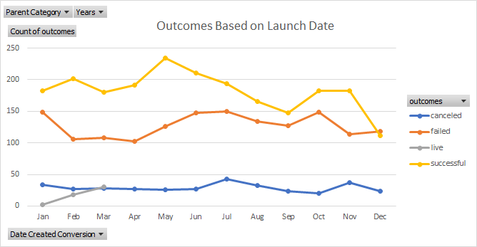

# An Analysis of Kickstarter Campaigns

## Overview of Project

- Performing analysis on Kickstarter data to uncover trends

### Purpose

- Began this anlysis organizing the kickstarter data presented to draw insights to provide Louise with the best possible recommendation for her next play/musical project. 

## Analysis and Challenges
- Our first finding when utilizing the filtering tool to view only relevant data was that there were 525 successful theater kickstarters in the U.S. Next, we put the data into pivot tables and our next finding revealed that May was the month with the most succesfully launched campaigns.
- 
-  However we also drew that January, June, July and October all had roughly the same amount of failed campaigns launched. Laslty, we anlyzed the measures of central tendency in our "Descriptive Statistics Tab" and based on those statistics we determined the mean of of each distribution is around the thrid quartile with the data following similar distributions in each subset. 
-  The standard deviations are larger than the mean which told us everything below the mean is considered to be "close" to the center. Therefore, some large values were driving these distributions. 

## Results
- The standard deviations are roughly twice the IQR in each distribution except in the failed kickstarts where the standard deviation is closer to 3 times the IQR which means there must be some failed kickstarters with extremely high goals. 
- Based on these findings our reccomendation would be to launch the campaign in May for a month long and with the goal to fundraise $5,000. 

